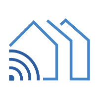

<a name="readme-top"></a>
<!--
*** Readme based upon Best-README-Template.
-->


<!-- PROJECT SHIELDS -->
<!--
*** I'm using markdown "reference style" links for readability.
*** Reference links are enclosed in brackets [ ] instead of parentheses ( ).
*** See the bottom of this document for the declaration of the reference variables
*** for contributors-url, forks-url, etc. This is an optional, concise syntax you may use.
*** https://www.markdownguide.org/basic-syntax/#reference-style-links
-->
[![Contributors][contributors-shield]][contributors-url]
[![Forks][forks-shield]][forks-url]
[![Stargazers][stars-shield]][stars-url]
[![Issues][issues-shield]][issues-url]
[![MIT License][license-shield]][license-url]


<!-- PROJECT LOGO -->
<br />
<div align="center">
  <a href="https://github.com/FutureProofHomes/Satellite1-Hardware">
    
  </a>

<h3 align="center">Satellite1</h3>

  <p align="center">
    A Private Voice Assistant & Multi-sensor with Room Presence Detection, Music Streaming Capablities & Smart Home Control.
    <br />
    <a href="https://docs.futureproofhomes.net"><strong>Explore the docs (Coming Soon) »</strong></a>
    <br />
    <br />
    <a href="https://www.youtube.com/@futureproofhomes">View Demo</a>
    ·
    <a href="https://github.com/FutureProofHomes/Satellite1-Hardware/issues/new?labels=bug&template=bug-report---.md">Report Bug</a>
    ·
    <a href="https://github.com/FutureProofHomes/Satellite1-Hardware/issues/new?labels=enhancement&template=feature-request---.md">Request Feature</a>
  </p>
</div>


<!-- TABLE OF CONTENTS -->
<details>
  <summary>Table of Contents</summary>
  <ol>
    <li>
      <a href="#about-the-project">About The Project</a>
      <ul>
        <li><a href="#built-with">Built With</a></li>
      </ul>
    </li>
    <li>
      <a href="#getting-started">Getting Started</a>
      <ul>
        <li><a href="#prerequisites">Prerequisites</a></li>
      </ul>
    </li>
    <li><a href="#usage">Usage</a></li>
    <li><a href="#roadmap">Roadmap</a></li>
    <li><a href="#contributing">Contributing</a></li>
    <li><a href="#license">License</a></li>
    <li><a href="#contact">Contact</a></li>
    <li><a href="#acknowledgments">Acknowledgments</a></li>
  </ol>
</details>


<!-- ABOUT THE PROJECT -->
## About The Project
The Satellite1 is a completely private and and open-source voice assistant/multisensor with advanced audio processing and music streaming capabilities. It focuses on controlling your smart home via the [Home Assistant platform](https://www.home-assistant.io/) and their incredible [Assist voice control pipeline](https://www.home-assistant.io/voice_control/). With some extra GPU powered server and software you can even power your Satellite1 with your own local LLM.

In Q4 2024 you will be able to purchase all the parts necessary to build your own Satellite1 at [FutureProofHomes.net](https://futureproofhomes.net).

The Satellite1 is designed to sit on a desk and be used with the built-in speaker.  In 2025 we will introduce an official enclosure and a ceiling mount with high-powered amplifier so that the Satellite1 can be used with in-ceiling speakers.  We highly recommend the in-ceiling approach as the user-experience is amazing.

[![Satellite1][combo_render]](https://futureproofhomes.net/)
<i>Enclosure w/ speaker mesh coming in 2025.</i>

## Why Open Source?
The Satellite1 is a powerful device - and with great power, comes great responsibility.  We believe it would be irresponsible to ask our customers to **_trust_** that our hardware and software protect your privacy.  Instead, you can audit the product yourself.  You can also build with us!  Please contribute to the project (and perhaps even join the team).

## Why Purchase from FutureProofHomes?
Put simply, your purchase helps fund our team and further innovation towards our roadmap.  Also, purchasing from us ensures you get top-quality products that are tested, fully-functional, in stock (as often as possible) and provide community leadership.  You can purchase Satellite1 components individually, or purchase the entire devkit as a package.  Help us, help you!

## Key Hardware Features
- [ ] ESP32-S3 n16r8 SoC
- [ ] Far-Field Microphone Array with Premium XMOS Noise Reduction and Echo Cancellation
- [ ] XMOS Audio Processing
- [ ] Power DAC capabile of ?watts?
- [ ] DAC 3.5mm Headphone Line Out
- [ ] Hardware Mute Button
- [ ] Volume Up/Down & Action Buttons
- [ ] 12 NeoPixel LEDs
- [ ] Temperature/Humidity/Light Sensor on board
- [ ] USB-C Power Delivery for easy power input
- [ ] Expandable GPIO for Hackability and Additional Functionality

## Key Software Features
- [ ] Easily Modifiable & Flashable Firmware via [ESPHome](https://esphome.io/index.html).
- [ ] On-Device WakeWord support.  Choose your own WakeWord or [create your own Wakeword](https://www.home-assistant.io/voice_control/create_wake_word/).  "Hey, Jarvis", "Alexa", "Alfred".
- [ ] Supports TTS Announcements via Home Assistant
- [ ] Supports MP3 Music Streaming via HA Media Browser or [Music Assistant](https://music-assistant.io/)
- [ ] Supports Bluetooth Room Presence Detection via [Bermuda](https://github.com/agittins/bermuda?tab=readme-ov-file) (Apple Watches Included)
- [ ] Exposes All Sensor Data Like Any Good Multi-Sensor Should

## Interoperability
- [ ] The Satellite1 HAT will work with ESP32, Raspberry Pi and Mac/PC USB connection.


<p align="right">(<a href="#readme-top">back to top</a>)</p>


### Built With

* [![KiCad][kicad.org]][kicad-url]
* [![ESPHome][esphome.io]][esphome-url]

<p align="right">(<a href="#readme-top">back to top</a>)</p>


<!-- GETTING STARTED -->
## Getting Started

- [Docs.FutureProofHomes.net](https://docs.futureproofhomes.net) is going live soon.
- [FutureProofHomes.net](https://futureproofhomes.net) main website is live and more info and stock is coming in soon!

<!-- This is an example of how you may give instructions on setting up your project locally.
To get a local copy up and running follow these simple example steps. -->

### Prerequisites

- For smart home control you'll need a functional Home Assistant server.  [Installation instructions here.](https://www.home-assistant.io/installation/)
- For AI/LLM interactions you'll need a GPU, Instruct LLM, and custom software, plus some hacks (at the time of writing this).  This will become easier in the future.  Stay tuned.

<!-- This is an example of how to list things you need to use the software and how to install them.
* npm
  ```sh
  npm install npm@latest -g
  ``` -->


<!-- USAGE EXAMPLES -->
## Usage

- [FutureProofHomes YouTube](https://www.youtube.com/@futureproofhomes) tutorials are coming soon on our channel

<!-- Use this space to show useful examples of how a project can be used. Additional screenshots, code examples and demos work well in this space. You may also link to more resources. -->

_For more examples, please refer to the [Documentation](https://docs.futureproofhomes.net)_

<p align="right">(<a href="#readme-top">back to top</a>)</p>


<!-- ROADMAP -->
## Roadmap

- [ ] FutureProofHomes Sat1 PCB Dev Kit
- [ ] Sat1 Enclosure
- [ ] Sense360 Ceiling Mount & Amplifier1
- [ ] AI Base Station

Learn more on our website: [FutureProofHomes.net](https://futureproofhomes.net)

<p align="right">(<a href="#readme-top">back to top</a>)</p>


<!-- CONTRIBUTING -->
## Contributing

Contributions are what make the open source community such an amazing place to learn, inspire, and create. Any contributions you make are **greatly appreciated**.

If you have a suggestion that would make this better, please fork the repo and create a pull request. You can also simply open an issue with the tag "enhancement".
Don't forget to give the project a star! Thanks again!

1. Fork the Project
2. Create your Feature Branch (`git checkout -b feature/AmazingFeature`)
3. Commit your Changes (`git commit -m 'Add some AmazingFeature'`)
4. Push to the Branch (`git push origin feature/AmazingFeature`)
5. Open a Pull Request

<p align="right">(<a href="#readme-top">back to top</a>)</p>


<!-- LICENSE -->
## License

Distributed under the CERN Open Hardware Licence Version 2 - Strongly Reciprocal Licesnse. See `LICENSE.txt` for more information.

<p align="right">(<a href="#readme-top">back to top</a>)</p>


<!-- CONTACT -->
## Contact

FutureProofHomes  - [Website](https://futureproofhomes.net/) - hello@futureproofhomes.net

<p align="right">(<a href="#readme-top">back to top</a>)</p>

<!-- YouTube -->
## YouTube

Checkout out our growing YouTube Channel  - [YouTube.com/@FutureProofHomes](https://www.youtube.com/@futureproofhomes)

<p align="right">(<a href="#readme-top">back to top</a>)</p>

<!-- ACKNOWLEDGMENTS -->
## Acknowledgments

* @alextrical, @gnumpi & @ben-gineering for joining my wild adventures and the company
* @redbull for the wings
* Huge thanks to all the @FutureProofHomes YouTube subscribers for encouraging us to do this.  You give us meaning and purpose.  Thank you.

<p align="right">(<a href="#readme-top">back to top</a>)</p>


<!-- MARKDOWN LINKS & IMAGES -->
<!-- https://www.markdownguide.org/basic-syntax/#reference-style-links -->
[contributors-shield]: https://img.shields.io/github/contributors/FutureProofHomes/Satellite1-Hardware.svg?style=for-the-badge
[contributors-url]: https://github.com/FutureProofHomes/Satellite1-Hardware/graphs/contributors
[forks-shield]: https://img.shields.io/github/forks/FutureProofHomes/Satellite1-Hardware.svg?style=for-the-badge
[forks-url]: https://github.com/FutureProofHomes/Satellite1-Hardware/network/members
[stars-shield]: https://img.shields.io/github/stars/FutureProofHomes/Satellite1-Hardware.svg?style=for-the-badge
[stars-url]: https://github.com/FutureProofHomes/Satellite1-Hardware/stargazers
[issues-shield]: https://img.shields.io/github/issues/FutureProofHomes/Satellite1-Hardware.svg?style=for-the-badge
[issues-url]: https://github.com/FutureProofHomes/Satellite1-Hardware/issues
[license-shield]: https://img.shields.io/github/license/FutureProofHomes/Satellite1-Hardware.svg?style=for-the-badge
[license-url]: https://github.com/FutureProofHomes/Satellite1-Hardware/blob/master/LICENSE.txt
[linkedin-shield]: https://img.shields.io/badge/-LinkedIn-black.svg?style=for-the-badge&logo=linkedin&colorB=555
[linkedin-url]: https://linkedin.com/in/linkedin_username
[genaimockup]: assets/images/mockup.png
[combo_render]: assets/images/combo_render.png
[kicad.org]: https://img.shields.io/badge/KiCad-314CB0?style=for-the-badge&logo=kicad&logoColor=white
[kicad-url]: https://www.kicad.org/
[esphome.io]: https://img.shields.io/badge/-ESPHome-000000?style=for-the-badge&logo=esphome&logoColor=white
[esphome-url]: https://esphome.io/
